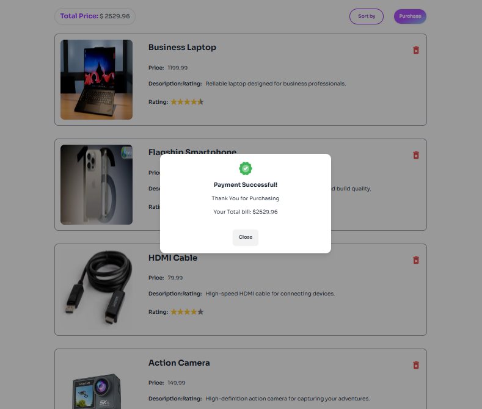

# Project Name: Gadget Pookie (Electronics and gadget purchase shop).

## Short Description:

This is a online shope web application where you can find all kind of electronics and gadget, like phone laptop, accessories and etc. You can buy easily what you want to need.

## List of React Fundamental concepts used in the project

1. **JSX (JavaScript XML)**
2. **Components**
3. **Props**
4. **State**
5. **Event Handling**
6. **Conditional Rendering**
7. **useEffect Hook**
8. **CReact Router (Routing)**
9. **Conditional Rendering**
10. **Conditional Rendering**
11. **Conditional Rendering**

## Im using local storage for for handling and managing data in this web app.

## Key features of your website/project.

- **Add curt list**
- **Add Wish**
- **See Every Product Details**
- **See Categories Ways Product**
- **Statistics For Price Compere**
- **Product Remove From Wish And Cart List**

## Requirement Document

[Requirement Document Link](https://github.com/ProgrammingHero1/B10-A8-gadget-heaven/blob/main/Batch-10_Assignment-08.pdf).

## Live Link

[GadgetPookie Web App](https://mz-gadget-pookie.surge.sh/).

### Preview

